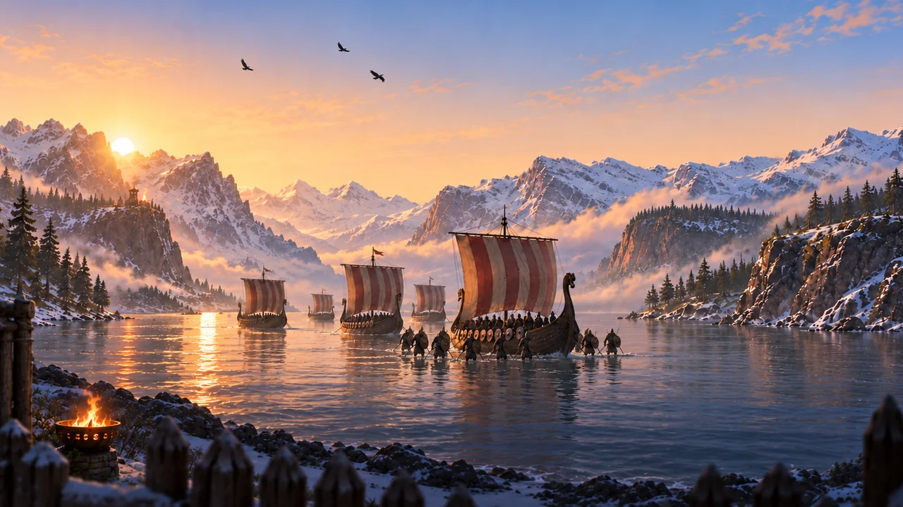

# Fjord Defence

A tower defence game about holding a Norse village against raiders. It runs in any browser, works with touch and mouse, and needs nothing installed.

**[Play it here](https://yourname.github.io/fjord-defence/)**

## What it is

Raiders land in the bay and walk a fixed path toward your gates. You line that path with towers and try to stop them before they get through. Fifteen maps, each with its own layout: spirals, pincers, switchbacks, a ring around a central island, and one map where three roads funnel into a single corridor.

## Towers

Seven types, three levels each.

- **Archers** hit fast and reach the air, but armour eats most of the damage
- **Frost rune** barely hurts anything and slows everything
- **Catapult** throws a boulder that splashes, and at level three it stuns
- **Gungnir ballista** spears several enemies standing in one line
- **Fire altar** burns and melts armour off whatever walks into the cone
- **Rune of return** does not kill, it throws enemies back down the path
- **Thor's totem** chains lightning and ignores armour completely

Fire and frost fight each other on purpose. Flame melts a frozen target and deals extra damage doing it, while a frost shard puts out a burning one and cannot freeze it for a couple of seconds after. Putting an altar next to a frost rune is a mistake, and finding that out is part of the game.

## Enemies

Shieldmen lock into a shield wall when they march together and split into two raiders when they die. Berserkers charge forward at double speed every few seconds. Shamans heal everyone around them and knock out one of your towers for a moment. Ravens fly over half your arsenal. Three different bosses turn up on the boss maps.

## Progress

Towers are not unlocked by reaching a level, they are bought in the Workshop for silver. Rank one lets you build a type, rank two and three unlock its upgrades in battle. Village lives carry over between maps and are not refilled for free, so a sloppy win costs you on the next map.

Three difficulties, each with its own separate profile: silver, workshop ranks, stars and lives do not cross over. Grinding an easy run to fund a hard one does not work.

## Running it locally

Clone or download, then open `index.html`. That is all. No build step, no npm, no server.

## Tech

Plain JavaScript and Canvas 2D, about 4000 lines in one file. Sprites are packed into WebP atlases with the frame index inlined into the HTML, so the game works from `file://` with no network requests at all. Sound is synthesised at runtime with WebAudio, so there are no audio files and no sample licences to worry about.

## Credits and licences

Art was produced for this project. Fonts are Lato and Inter, both under the SIL Open Font License. See `LICENSES.txt`.

## Status

Playable start to finish and balanced by simulation: a bot plays every level on every progression state to check that the first two maps are winnable with nothing bought, and that the later ones are not.
